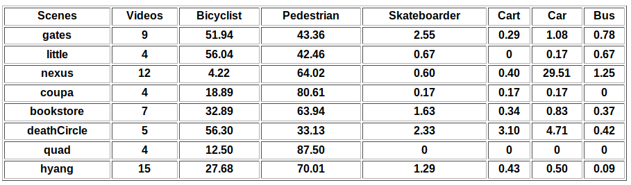

# Drone Surveillance
Pedestrian detection from aerial view and neural network compression

## Content
1. Neural Network Compression
2. Pedestrian Detection from aerial view

## 1. Neural Network Compression

* By making architectural changes eg. [SqueezeNet](https://arxiv.org/abs/1602.07360)
* By doing compression post training eg. [Deep-compresion](https://arxiv.org/abs/1510.00149)

### Experiments
* LeNet-5 on MNIST dataset

**Results**

## 2. Pedestrian Detection from Aerial View
# Dataset Description
We have used stanford drone dataset : http://cvgl.stanford.edu/projects/uav_data/.

