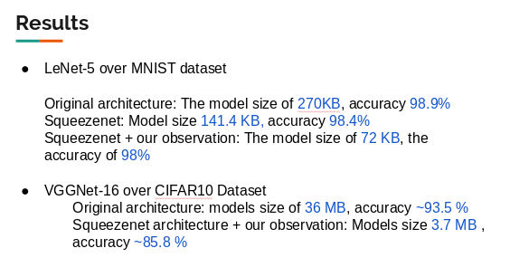
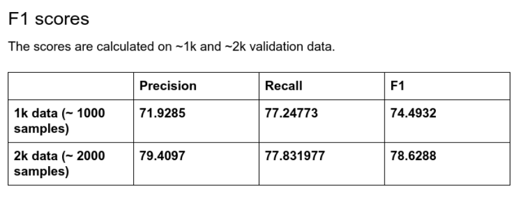

# Drone Surveillance
Pedestrian detection from aerial view and neural network compression

## Content
1. Neural Network Compression
2. Pedestrian Detection from aerial view

## 1. Neural Network Compression

* By making architectural changes eg. [SqueezeNet](https://arxiv.org/abs/1602.07360)
* By doing compression post training eg. [Deep-compression](https://arxiv.org/abs/1510.00149)

### By Making architechturalchanges
**Observations**
* Maxpool over average pool
* Decrease in number of feature maps deep in the architecture
* Number of feature maps per layers depends upon the type of dataset chosen
* Fire models should be implemented later in the network
* Replacing 5x5 with two 3x3 results in slight drop in accuracy

### Experiments
By making architechtural changes in reference to SqueezeNet

**Results**

## 2. Pedestrian Detection from Aerial View
### Dataset Description
We have used stanford drone dataset : http://cvgl.stanford.edu/projects/uav_data/.

* Sampled frames from different scenes in a deterministics approach
* Created subsets of the dataset consisting of ~100, ~1000 and ~2000 video frames
* ~100 image samples: consisting of ~2144 objects in total across all images
* ~1k   image samples: consisting of ~15545 objects in total across all images
* ~ 2k  image samples:  consisting of  ~19926 objects in total across all images
* Corresponding test sets also contain the respective number of images

### Results

### Loss convergence graphs

### Demo Inference Videos

**TO DO**